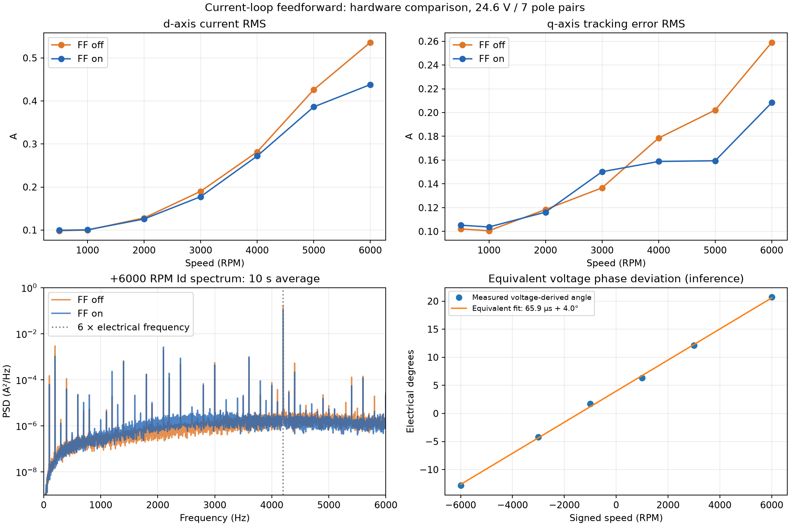

# 电流环解耦测试记录

更新：2026-10-08。记录有感 dq 交叉耦合与反电动势前馈的代码分析、实机对照和结论边界。
总入口见[测试与问题记录索引](测试与问题记录索引.md)。

本轮在相同 PI 参数下完成逐级升速和 ±6000 RPM 对照。开启前馈后，高速 Id RMS 和
Iq 跟踪误差有所下降，未新增保护故障、快环超期、编码器错误或遥测丢帧。
仍存在明显的 6 倍电频率纹波；按用户要求，本阶段只记录，暂不处理该谐波问题。
同日 ADC 过采样与短采样周期对照见[电流采样与调制测试记录第 10 节](电流采样与调制测试记录.md#adc-short-oversampling-20261008)，
该试验仅覆盖失能及零转矩使能，不能作为本节高速谐波的处理结果。

- [1. 固件、模型与测试条件](#setup-20261008)
- [2. 解耦实现与静态分析](#implementation-20261008)
- [3. 实验方法与统计口径](#method-20261008)
- [4. 实测对照](#results-20261008)
- [5. 6 倍电频率与三相 5/7 次谐波](#harmonics-20261008)
- [6. 电压相位偏差的等效分析](#voltage-angle-20261008)
- [7. 实时性、收尾状态与证据](#artifacts-20261008)

<a id="setup-20261008"></a>

## 1. 固件、模型与测试条件

分支 `feat/current-frf-injection`，提交 `aa0425923db2be0a4149828f59a2340b06deff04`。
解耦实现来自 `2ffef46`；同日还调整了 ESO 更新顺序、Park 反馈复用，并新增 d 轴频响注入。
本轮未改控制源码，未调整 PI 增益，也未执行 d 轴 FRF 注入。

最初连接的固件不支持 `0x0A07` 前馈开关和 `0x0B04` 注入状态参数。
确认电机失能后备份应用区及 NVS，构建当前分支 Release 并下载，OpenOCD 报告
`Verified OK`。下载后原有持久化参数逐项一致，NVS 逐字节一致；新增前馈开关为 0。

下载 ELF SHA256：

```text
30bfa9933369c6af7a987a5570883b9c3f61216342b4803798afe9d13e5f2352
```

实际使用板上保存的 7 极对模型，不是编译默认的 16 极对模型：

| 项目 | 本轮数值/配置 |
|---|---|
| 母线 | 静止约 24.63 V，6000 RPM 稳态约 24.52 V |
| 极对数 Pp | 7 |
| Rs | 0.28252554 Ω |
| Ld / Lq | 71.38222 / 71.38222 μH |
| Flux | 0.0022811948 Wb |
| J / B | 1.6780368e-5 kg·m² / 1.2819887e-5 N·m·s/rad |
| 编码器 | SPI MT6835，Ready=Valid=1，Fault=0，校准有效 |
| Enc_Dir / Theta_Off | −1 / 6.1065125 rad |
| 电流环 | Bandwidth 模式，设计带宽 2000 Hz；d/q Kp=0.8970154、Ki=3550.3208 |
| 速度环 | Manual 模式，Kp=0.04、Ki=0.3；输入为电角速度误差 |
| 机械 ESO 带宽 | 100 Hz |
| 运动模式 | SPEED，梯形规划，加/减速度 100 rad/s² |
| PWM / 电流环 | 20 kHz，Ts=50 μs |
| 电压限制 | `U_Lim = 0.88 × Vbus / sqrt(3)` |
| 临时电流指令上限 | 2 A；是试验限制，不是电机额定值 |
| 临时速度指令上限 | 6000 RPM |

未测量轴端负载转矩或温升；±6000 RPM 稳态 Iq 均值绝对值约 0.20 A。
结论限于本次实际负载条件，不作为额定负载或长时间热稳定性验收。

<a id="implementation-20261008"></a>

## 2. 解耦实现与静态分析

[Motor_ADC.c](../Motor/Motor_ADC.c) 使用本周期电流反馈，在 PI 输出之后、最终 dq 矢量限幅之前叠加：

```text
We = Pp * Mechanical_ESO.State.Wm
Ud = Ud_PI - We * Lq * Iq
Uq = Uq_PI + We * (Ld * Id + Flux)
```

仅在前馈开关开启、有感 Torque/Speed/Position 模式且编码器 Park 条件有效时执行。
当前 Park 定义为 `Id=Iα*cosθ+Iβ*sinθ`、`Iq=−Iα*sinθ+Iβ*cosθ`，与上述补偿符号一致。
We 为电角速度 rad/s，L 为 H，电流为 A，Flux 为 Wb，前馈输出为 V。

电流 PI 采用 `Kp=L*Wc`、`Ki=Rs*Wc`，积分更新内部乘 Ts。
在模型准确、时序理想且电压未饱和的条件下，该补偿使各轴对象接近 `1/(Ls+Rs)`。
这不等于已实测 2000 Hz 闭环带宽或稳定裕度。

抗积分饱和仍有静态缺口：[PID.c](../Algo/PID.c) 只根据 PI 自身的单轴输出判断是否停止积分，
后续“PI 加前馈再做矢量限幅”的结果未反馈给积分器。接近电压上限时可能继续积累积分。
该缺口在原有双轴矢量限幅中也存在；本轮高速稳态未触及限幅，不能验证或排除此风险。
本轮未修改抗积分饱和算法。

<a id="method-20261008"></a>

## 3. 实验方法与统计口径

两轮测试均在失能状态切换前馈，保持电流 PI、速度 PI、ESO 参数一致：

1. `forward_6000`：FF=0 后 FF=1，各自依次运行 +500、+1000、+2000、+3000、
   +4000、+5000、+6000 RPM。每级等待按 100 rad/s² 估算的加速时间，再保持 3 s。
2. `bidirectional_6000`：交换顺序，先 FF=1 后 FF=0，各自运行 +1000、+3000、+6000 RPM，
   回零后运行 −1000、−3000、−6000 RPM。±6000 RPM 各自在估算加速时间之后保持 12 s。
3. 每组最后下发零速，等待减速及稳定，再 Stop、Disable。整个试验结束后恢复原参数。

采用原有 USB Plot，未通过 SWD 更换遥测指针：

- FAST：20 kHz、6 通道，依次为 `Id、Iq、Ud、Uq、Iq_ref、Ud_PI`，int16，全部比例 0.001。
  `Ud/Uq` 为限幅后的电压命令，`Ud_PI` 为前馈之前的 PI 输出。
- NORMAL：1 kHz、13 通道，记录 Vbus、ESO Wm、速度参考、Ia/Ib、dq 电流、电压、
  Iq_ref、Ud_PI、ESO 误差、多圈位置。相电流峰值只代表所采样点。
- SWD 只在失能时读取前后诊断计数，运动期间没有连接调试器暂停、打断点或修改 RAM 指针。

主机在 dq 电流幅值或所采相电流超过 4 A、母线超出 22～28 V、速度超过 6600 RPM、
Iq_ref 超过 2.01 A、遥测中断超过 300 ms、丢帧或保护/编码器故障时中止。
每级稳态平均速度偏差超过 `max(100 RPM, 5%)` 或平均电压利用率超过 95% 时停止继续升速。
这些是主机试验退出条件，不能替代固件保护或定义电机额定能力。

最终统计采用 `analysis.json`：

- 第一轮各非零速度段最后 2 s；第二轮 ±6000 RPM 各取最后连续 10 s。
- Id 指标为 RMS；Iq 跟踪误差为同 FAST 样本的 `RMS(Iq−Iq_ref)`，不等同于 Iq 自身 RMS。
- 速度均值、标准差来自 ESO；位置斜率由同一编码器多圈位置按 NORMAL 序号拟合。
  两者相符是内部一致性检查，不是独立测速仪验证。
- 频谱把 10 s 划分为 10 个 1 s 段，每段去均值、加 Hann 窗并平均功率谱，频点间隔 1 Hz。
  6fe 谐波指标在平均转速对应的 `6fe±25 Hz` 频带积分后开平方，是频带 RMS，不是单点峰值。
- FAST 电压利用率以该稳态窗口平均 Vbus 换算，母线与电压不是同一时刻采样。
  它是主机估计值，不能用于证明瞬时限幅精度。

控制台每级即时摘要使用最后 1 s，仅供运行监控；文中采用上述离线口径，数值可能略有不同。

<a id="results-20261008"></a>

## 4. 实测对照

### ±6000 RPM 连续 10 s 统计

| 指令 RPM | 前馈 | 平均 RPM | RPM 标准差 | Id RMS (A) | Iq 跟踪误差 RMS (A) | dq 电流幅值峰值 (A) |
|---:|---|---:|---:|---:|---:|---:|
| +6000 | 关闭 | 6000.006 | 9.568 | 0.5280 | 0.2221 | 1.748 |
| +6000 | 开启 | 6000.027 | 9.045 | 0.4383 | 0.2032 | 1.628 |
| −6000 | 关闭 | −6000.030 | 11.311 | 0.5403 | 0.2302 | 1.859 |
| −6000 | 开启 | −6000.028 | 10.507 | 0.4542 | 0.1827 | 1.754 |

开启前馈后：正向 Id RMS 降低约 17.0%，反向约 15.9%；Iq 跟踪误差 RMS 分别降低约
8.5% 和 20.6%。交换前馈测试顺序后，高速改善仍存在，但不据此给出全工况固定改善比例。
四个窗口 Id 均值绝对值均小于 4 μA；这是含正负纹波的数字样本均值，不能解释为传感器具有 μA 精度。

编码器位置斜率依表中顺序为 +5999.995、+6000.021、−5999.977、−6000.028 RPM。
四个窗口的速度极值总范围为 +5980.954～+6016.718 RPM、−6018.442～−5978.193 RPM。

稳态平均电压利用率约 80.9%；相对当前 `0.88*Vbus/sqrt(3)` 上限的 FAST 峰值估计最高约 91.5%，
没有超过 99% 的样本。此处 80.9% 是对固件电压上限归一化，对 `Vbus/sqrt(3)` 的调制度约为 0.712。
本轮不是电压饱和或弱磁测试。

### 逐级升速结果

第一轮各阶段最后 2 s，单位 A：

| RPM | Id RMS，FF=0 | Id RMS，FF=1 | Iq 误差 RMS，FF=0 | Iq 误差 RMS，FF=1 |
|---:|---:|---:|---:|---:|
| 500 | 0.0985 | 0.0995 | 0.1020 | 0.1052 |
| 1000 | 0.1000 | 0.1006 | 0.1006 | 0.1037 |
| 2000 | 0.1281 | 0.1257 | 0.1184 | 0.1162 |
| 3000 | 0.1899 | 0.1775 | 0.1367 | 0.1502 |
| 4000 | 0.2817 | 0.2720 | 0.1785 | 0.1588 |
| 5000 | 0.4261 | 0.3862 | 0.2021 | 0.1594 |
| 6000 | 0.5360 | 0.4380 | 0.2590 | 0.2083 |

低速差异很小，3000 RPM 的 Iq 误差并非改善，不能笼统表述为“开前馈所有速度都更好”。
当前结果支持保留该解耦方案并继续验证，不支持把它视为谐波问题已经解决。



图中上排采用第一轮各段最后 2 s；下排频谱采用第二轮正向 6000 RPM 的 10 s 数据，
相位拟合采用第二轮正反向 1000/3000/6000 RPM 数据。

<a id="harmonics-20261008"></a>

## 5. 6 倍电频率与三相 5/7 次谐波

6000 RPM、7 极对时，机械频率 `fm=6000/60=100 Hz`，电频率 `fe=7*fm=700 Hz`。
实测 Id 主要频谱峰在 **4200 Hz=6fe**，并且前馈开启后仍明显存在。

按当前 Park 约定，令 `iαβ=iα+j*iβ`、`idq=Id+j*Iq`，则 `idq=iαβ*exp(−jθe)`。
对于平衡三相基波及典型 5/7 次分量：

```text
iαβ = I1*exp(jθe) + I5*exp(−j5θe) + I7*exp(j7θe)
idq = I1          + I5*exp(−j6θe) + I7*exp(j6θe)
```

| 三相/静止坐标系 | 同步 dq 坐标系 | 本工况对应的三相频率 |
|---|---|---:|
| 5 次负序 | −6 次旋转分量 | 3500 Hz |
| 7 次正序 | +6 次旋转分量 | 4900 Hz |

因此用户提出的“dq 6 次对应三相 5、7 次”是正确的。若仅有 `Id=A*cos(6θe)` 且 `Iq=0`，
反变换得到 `iαβ=A/2*[exp(j7θe)+exp(−j5θe)]`，即同时含 7 次正序和 5 次负序。
实际电流中 Id、Iq 都可能有 6 次分量，它们的幅值和相位共同决定 5/7 次的比例；
只看 Id 的实数频谱，不能分开确定两者。

死区畸变产生这类 5/7 次谐波、并映射为 dq 6 次纹波，是典型机制；
[MathWorks 的 PMSM 谐波示例](https://www.mathworks.com/help/slcontrol/ug/reduce-thd-in-pmsm-using-adaptive-notch-filter.html)
说明了该序分量与坐标变换关系。但频率对应本身不是本机死区来源的实验证明。
逆变器其他非线性、反电动势谐波、角度及采样误差仍可能参与。

本轮 FAST 未记录三相电流和电角度；1 kHz NORMAL 的 Ia/Ib 不能直接验证 3500/4900 Hz 谐波。
因而三相 5/7 次频率是坐标变换解释，不写成已测得的三相 FFT 结果。
固件 TIM1 配置的 `DeadTime=0`，最终 BDTR 低 8 位也为 0；这只说明定时器 DTG 配置，
不能说明驱动器及实际功率开关没有有效死区或开关延迟。本轮未测量栅极死区波形。

### 6fe 频带 RMS（第二轮，每工况 10 s）

| RPM | 前馈 | Id 的 6fe 频带 RMS (A) | Iq 的 6fe 频带 RMS (A) |
|---:|---|---:|---:|
| +6000 | 关闭 | 0.5042 | 0.1905 |
| +6000 | 开启 | 0.4113 | 0.1354 |
| −6000 | 关闭 | 0.5134 | 0.1800 |
| −6000 | 开启 | 0.4261 | 0.1259 |

此表 Iq 指标是 Iq 本身的频带 RMS，与第 4 节 `Iq−Iq_ref` 的全频带误差 RMS 不同。
Id 的主要纹波确实集中在该频带，前馈降低其幅值，但没有消除。

**处理决定：暂不解决该谐波问题。** 不在本轮修改死区、加入谐波控制或补偿；
不因为存在 6fe 就直接更改 PI 参数。后续若开展谐波专题，应另行制定测试和变更计划。

<a id="voltage-angle-20261008"></a>

## 6. 电压相位偏差的等效分析

第二轮正向 6000 RPM、前馈开启时：

- 平均 Ud≈−3.5981 V、Uq≈9.4099 V，Ud_PI≈−3.5357 V。
- 实测平均 `Ud−Ud_PI≈−0.06241 V`，按平均转速、电流计算的 `−We*Lq*Iq≈−0.06254 V`。
  两者接近，支持 d 轴交叉前馈按预期生效；平均量乘积与乘积平均并不严格相同。
- 总 Ud 的绝大部分仍由 PI 提供，不能把 −3.6 V 都解释为 `−We*Lq*Iq`。

利用稳态电压命令和平均电流估算：

```text
Ed = Ud − Rs*Id + We*Lq*Iq
Eq = Uq − Rs*Iq − We*Ld*Id
δ  = atan2(−Ed/We, Eq/We)
```

对第二轮 ±1000/±3000/±6000 RPM、两种前馈状态共 12 个窗口拟合
`δ≈δ0+We*Td`，得到等效 `δ0≈3.97°` 电角度、`Td≈65.93 μs`，角度残差 RMS≈0.30°。
正向 6000 RPM 的 δ≈20.7°，反向约 −12.8°；前馈开关未明显改变该关系。

这是基于软件电压命令、稳态模型的**等效拟合**，没有测量实际端电压或 PWM 生效时刻。
不能据此直接认定编码器延迟、寻相误差或具体器件故障，也不能直接把拟合值写成补偿参数。
它与第 5 节的 6fe 谐波是不同观察项；本轮没有实施角度/延迟补偿。

<a id="artifacts-20261008"></a>

## 7. 实时性、收尾状态与证据

第一轮采集 1,520,870 个 FAST 样本、76,045 个 NORMAL 样本；第二轮分别为
2,703,580、135,180。两轮均无序号丢失，固件 Plot 丢块计数无新增。
Deadline_Miss、编码器错帧及快环编码器缺帧计数均无新增，结束 Fault/Error/Trip=0。

试验后累计 `ADC_Run_Max=2488` 个周期、`Fast_Max=7236` 个周期，按 160 MHz 分别为
15.55 μs、45.225 μs。前者包含快环计算及 FAST 采样；后者从编码器触发链路起点计时，
不能当作纯 PI 或纯前馈算法耗时。本轮未单独剖析前馈开关的 CPU 耗时差。

最终确认：

- 电机 DISABLED，PWM MOE=0，目标速度=0，注入 Active=0。
- 模式恢复 TORQUE，前馈恢复关闭，用户电流/速度限值恢复 10 A / 12000 RPM。
- 下载后的全部持久化参数与测试后逐项一致，NVS 与下载前逐字节一致，未执行 Save。
- 开发板保留本轮下载的当前分支固件；本轮运行测试不等于完整饱和、高负载、长时间或 FRF 验收。

原始记录目录：`/tmp/current_ff_highspeed_20261008/`，其中：

| 文件/目录 | 内容 |
|---|---|
| `before.json` / `after.json` / `flash.json` | 下载前后参数、状态及固件校验信息 |
| `before_application.bin` / `before_nvs.bin` | 原应用区及参数区备份 |
| `program.log` | OpenOCD 下载、校验日志 |
| `forward_6000/` | 第一轮逐级升速；`result.json`、`normal.csv`、`fast.raw` |
| `bidirectional_6000/` | 第二轮正反转；同上，并含前后时序日志 |
| `run_test.py` | 本轮临时主机测试脚本；依赖当前仓库 tools 协议实现 |
| `analyze.py` / `analysis.json` / `comparison.png` | 离线分析脚本、最终统计与图 |
| `final.json` / `final_nvs.bin` | 最终失能、参数恢复及 NVS 核对 |

FAST 原始文件为行交错小端 int16，列顺序和比例见第 3 节；阶段起止 FAST 样本索引见各轮
`result.json` 的 `events`。临时目录可能被系统清理，关键结果与对照图已保留在本记录中。
