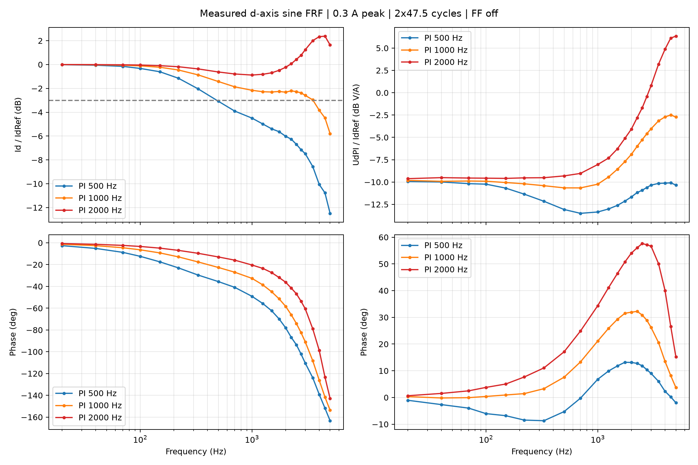
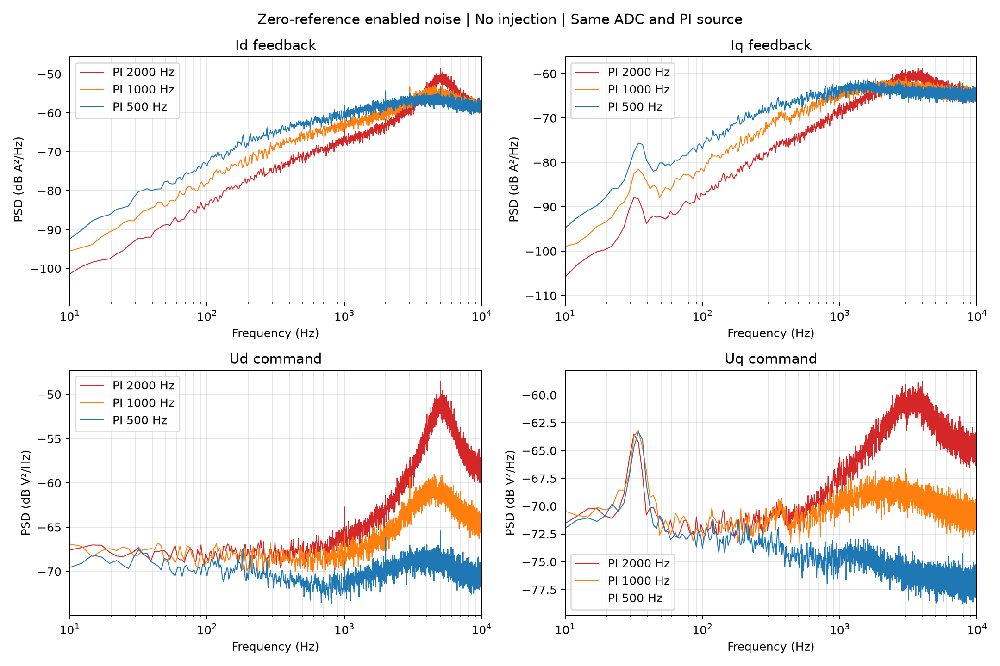

# 有感 d 轴电流环频率响应实验（第一阶段）

更新：2026-10-08。工具说明及[实机 Bode、PSD 与退出验证](#frf-hw-20261008)。

此阶段在 `TORQUE + ENABLED` 下向 `Id_Ref` 叠加有期限的正弦信号。
**仅验证控制环频响；不会自动 Enable / Run，不会写 Flash。**
FFT、同步正弦拟合和 Bode 绘图在 PC 完成；固件不做 DFT。

## 固件

- `Motor/Signal_Injection.c`：配置快照、20 kHz 同步正弦、有限样本数后清零。
- 参数 `0x0B01/0x0B02/0x0B03`：频率 Hz、幅值 A、持续时间 s；RAM only。
- 动作 `0x1301` Start、`0x1302` Abort。仅 `TORQUE+ENABLED` 能 Start。
- Stop、Disable、Run 和快环电流保护会撤销激励。
- FAST Plot：`0x0B05` 注入值、`0x0B06` 实际 IdRef、`0x0010` Id、
  `0x0B07` Id PI 输出。最后一项不含前馈及最终 dq 矢量限幅；
  对最终调制电压可另采 `0x0012` Ud。

Start 时按有效电流限值验证幅值，运行期间不修改正常目标或模式。
配置在 Start 时锁存，中途写入新配置不影响本频点。

## PC 脚本

依赖：

```bash
python3 -m pip install pyserial numpy matplotlib
```

先手动选择 TORQUE 模式并使能电机，关闭 dq 前馈并确认空载、稳定且无故障。
脚本不自动操作运动状态：

```bash
python3 tools/current_frf.py --port /dev/ttyACM0 \
  --freq 30 100 300 500 1000 2000 \
  --amp 0.1 --duration 2 --settle-cycles 2 \
  --out /tmp/current_frf --plot
```

每频点配置、启用原有 FAST Plot、执行限定时间的激励，记录连续的
4 通道 20 kHz `int16` 原始数据，再用含常数偏置的正余弦最小二乘拟合。
输出 `point_NNN.raw`（行交错 `<i2`，4 通道，量化比例各 0.001）、
`bode.json`、可选 `bode.png`。

频响：

- `Id / IdRef`：闭环电流跟踪，包含受控 PWM/电机对象。
- `UdPI / IdRef`：参考到原 PI 电压输出，不是电机电气对象或开环环路增益。

当丢帧或激励太弱、有效周期不足时，脚本拒绝输出当前频点结果。
建议先在小幅值与较低频率下验证波形和实验退出，再逐级提高频率。
测试会向 d 轴通入交流电流，不能因为 TORQUE+ENABLED 就认定零热负荷。

**脚本是实验工具，不保证随固件实时维护；使用前应检查实现和参数 ID，
并确认真实连接的硬件、固件版本及测试限值。**

## 验证范围

- 2026-10-08 已使用当前分支板端固件完成开始、自然结束、Stop/Disable/Abort、
  快环耗时和三组 PI 的 20～5000 Hz Bode/静止 PSD 对照，见下节。
- 本轮未覆盖 Run/保护触发撤销、激励配置锁存及重复 Start 的全部边界；
  未测高转速、负载、温升或 5000 Hz 以上的频响。
- 目前只支持 d 轴正弦；PRBS、q 轴、速度与位置环待独立验证后扩展。
- Bode 相位依赖实际注入参考与反馈同一 FAST 样本的时序；
  最终电压命令与 PWM 实际生效时刻不可错误视为同一采样瞬间。

<a id="frf-hw-20261008"></a>

## 2026-10-08：实机注入验证、三组 PI 的 Bode 与噪声 PSD

**注入的正常开始、自然结束、Stop/Disable/Abort 已通过实机验证。**
当前 2000 Hz 设置在 4～4.5 kHz 出现约 +2.4 dB 的闭环增益隆起；
扫到接口上限 5000 Hz 尚未找到 −3 dB 点，不能把设置值当作实测截止频率。
本轮结束恢复原参数并失能，未修改控制代码或保存 NVS。

### 条件、方法与数据口径

同一 STM32G474 开发板、电机及编码器，母线约 24.6 V，TORQUE + ENABLED，
Iq_ref=0，ADC 保持 **2×47.5 cycles、40 MHz**，PWM/快环 20 kHz，dq 前馈关闭。
固件源码提交 `aa0425923db2be0a4149828f59a2340b06deff04`；
采集时仓库提交 `a842051624027357ec426723b811153debe0b4ac` 仅比固件增加文档。
ELF 校验值及文件 SHA256 见[归档清单](data/current_frf_20261008/manifest.json)。
沿用前轮已核对的固件和硬件，未再次烧录。

- 注入退出验证：100 Hz、0.1 A 峰值；自然结束配置 0.3 s，其他退出配置 2 s 后提前中止。
- 频响：按 2000 → 1000 → 500 Hz 设置 PI，每组 22 点，共 66 点；每点注入 1 s、0.3 A 峰值。
  频点为 20、40、70、100、150、220、330、500、700、1000、1250、1500、1750、
  2000、2250、2500、2750、3000、3500、4000、4500、5000 Hz。
- 噪声：每组 PI 扫频前，在无注入、零转矩使能状态等待约 1 s，再取约 10 s 连续样本。
- PI 保持 Bandwidth 来源，仅临时改变带宽；电流指令限值临时设为 2 A。
  主机继续监测电流、速度、母线、参考、遥测连续性和板端故障状态。
- FRF FAST：`Injection、IdRef、Id、UdPI、Iq、Ud`；噪声 FAST：`Ia、Ib、Id、Iq、Ud、Uq`。
  均为 20 kHz、六列行交错小端 int16，比例均为 0.001。
  NORMAL 为 1 kHz 的 Vbus、Wm、Iq_ref、Theta_e、Position，CSV 另含主机时间与序号。
- FRF 舍弃起始 `max(4 个周期, 50 ms)`，对参考、反馈及 PI 输出做含直流项的正余弦拟合。
  绘制 `Id/IdRef` 和 `UdPI/IdRef`；后者不是电机对象，也不是开环环路增益。
  相位使用同一 FAST 样本的信号，未人为扣除延迟或对齐波形。
- PSD 使用 8192 点 Hann 窗、50% 重叠、每段去均值，单边功率密度，频率间隔 2.44140625 Hz。
  电流 PSD 单位 A²/Hz，电压命令 PSD 单位 V²/Hz；图中为 `10*log10(PSD)`。
  它们包含板载测量链路影响，未用独立电流探头或麦克风验证。

### 开始和退出行为

| 检查 | 实测结果 |
|---|---|
| DISABLED 时 Start | 返回 ERR_STATE，未激活 |
| ENABLED 时 Start | 正常激活；非零注入样本与同周期 IdRef 一致 |
| 0.3 s 自然结束 | Sample_Cnt=Sample_Max=6000；完整注入跨度 6000 样本，结束后 Out/IdRef 均为 0 |
| 中途 Stop | 在 3450/40000 样本时撤销，Out/IdRef=0；状态保持 ENABLED，PWM MOE=1 |
| 中途 Disable | 在 3490/40000 样本时撤销，Active=0、Out=0；DISABLED、PWM MOE=0 |
| 中途 Abort | 在 3440/40000 样本时撤销，Out/IdRef=0；仍 ENABLED |
| Disable 后重新 Enable | 下次 Start 前 Out/IdRef 均为 0，没有自动恢复上次激励 |

自然结束波形与 100 Hz、0.1 A 正弦的最大差约 0.00087 A，包含 0.001 A 遥测量化等误差。
Stop/Disable/Abort 的样本数是本次主机发命令的实际中止位置，不是固定撤销延迟；
主机通信没有与硬件时钟同步，不能用这些数给出逐周期命令响应上界。

**显示残留：**Disable 后 `Id_Ctrl.Sig.Ref` 遥测保留最后值约 0.03427 A，
FAST 量化显示为 0.034 A。注入状态及输出已清零，PWM 已关闭；
重新使能后参考归零。此项属于失能后未刷新的参考显示，本轮记录而未修改源码。

### Bode 对比



| PI 带宽设置 | 实测 −3 dB 交叉点 | 说明 |
|---|---:|---|
| 500 Hz | 约 484.7 Hz | 由 330/500 Hz 相邻点按对数频率插值 |
| 1000 Hz | 约 3519 Hz | 由 3500/4000 Hz 相邻点插值；中频有平台，不是一阶响应 |
| 2000 Hz | 20～5000 Hz 内未找到 | 4500 Hz 测得最大增益 +2.379 dB；5000 Hz 仍为 +1.644 dB |

上述阈值为相对单位增益的 −3 dB，各组低频增益接近 0 dB。
这些是本次 0.3 A 激励、静止工作点的离散频点估计，不是跨工作点保证的带宽。
接口上限为 5000 Hz，本轮没有绕过限制，也没有外推 2000 Hz 设置的截止频率。

2000 Hz 设置的代表点：

| 激励频率 | Id/IdRef 幅值 | 相位 |
|---:|---:|---:|
| 1000 Hz | −0.882 dB | −20.36° |
| 2000 Hz | −0.230 dB | −36.12° |
| 4000 Hz | +2.339 dB | −98.85° |
| 4500 Hz | +2.379 dB | −123.26° |
| 5000 Hz | +1.644 dB | −142.89° |

各频点将有效样本分为八段检查同频响应一致性，最小分段相干估计为 0.9935，
最大分段幅值标准差约 0.487 dB、相位标准差约 3.74°。
该指标检查本频点的重复一致性，不是独立宽带噪声实验的相干函数。
拟合区间内 Ud 与 UdPI 的量化值一致，未观察到最终矢量限幅改变 d 轴命令。

由同频相量计算 `UdPI/(IdRef−Id)`，与源码离散 PI
`Kp + Ki*Ts/(1−exp(−j*2π*f*Ts))` 比较：100 Hz 及以上，
三组最大幅值差小于 0.010 dB、相位差小于 0.25°。
这支持参数切换、采样通道及拟合口径的一致性，不是独立物理电流精度验证。
详细结果见[控制器一致性数据](data/current_frf_20261008/controller_consistency.json)。

### 无注入噪声 PSD 对比



| PI 设置 | Id 标准差（A） | Iq 标准差（A） | dq 电压交流 RMS（V） | Id 的 1～1000 Hz 频带 RMS（A） |
|---|---:|---:|---:|---:|
| 500 Hz | 0.12855 | 0.06053 | 0.036646 | 0.02191 |
| 1000 Hz | 0.13682 | 0.06261 | 0.075776 | 0.01546 |
| 2000 Hz | 0.16093 | 0.06799 | 0.173723 | 0.00904 |

dq 电压交流 RMS 为 `sqrt(var(Ud)+var(Uq))`，已去直流。
相对 2000 Hz 设置，1000/500 Hz 的电压扰动分别降低约 56.4%/78.9%。
2000 Hz 的高频 PSD 隆起更强，但低频反馈波动更小：降低 PI 增益存在调节能力与噪声的取舍，
不能只凭全频 RMS 或 −3 dB 点选择最终参数。此处反馈噪声不是独立测得的真实绕组电流，
也没有测量声压或宣称声音按相同比例改善。

### 快环耗时及结束状态

固定六个 FAST 通道，在相同 2000 Hz PI 下比较无注入 → 有注入 → 无注入。
每段通过非停机 SWD 读取 100 组运行时计数，各字段非原子采集；统计用于耗时分布比较，
不是逐周期同步追踪或最坏执行时间证明。

| 工况 | ADC_Run 中位耗时 | 快环链路中位耗时 |
|---|---:|---:|
| 注入前 | 13.0250 μs | 40.7875 μs |
| 注入中 | 13.8938 μs | 41.6031 μs |
| 注入后 | 12.8938 μs | 40.8313 μs |

相对前后两组中位数均值，注入增加 ADC_Run 约 **0.934 μs**，链路约 **0.794 μs**。
整个测试后累计 Fast_Max=7342 周期，即 **45.8875 μs / 50 μs**；
该最大值是累计记录，不能将其全归因于注入或用于保证所有工况。
Deadline、编码器缺帧/错误、CRC、FAST/NORMAL 丢块均无新增，采集序号无丢失。

结束恢复 2000 Hz PI、原模式/目标、10 A 用户电流限值及原注入配置；
ADC 仍为 2×47.5、前馈关闭。持久化参数逐项一致，未发送 Save；
DISABLED、MOE=0、注入 Active=Out=0、Ready=Valid=1、Fault/Error/Trip=0。

### 归档与复算

本次图表和数据保存在仓库 [data/current_frf_20261008](data/current_frf_20261008)，
不再依赖 `/tmp` 的存续：

| 文件 | 内容 |
|---|---|
| [bode.csv](data/current_frf_20261008/bode.csv) / [noise.csv](data/current_frf_20261008/noise.csv) | 66 个闭环频点与三组噪声关键数据 |
| `bode.png/svg`、`noise_psd.png/svg` | 位图及可编辑矢量图 |
| `psd_500.npz`、`psd_1000.npz`、`psd_2000.npz` | 频率轴、六通道线性 PSD、通道名；不是 dB 数组 |
| [summary.json](data/current_frf_20261008/summary.json) | 结论、恢复状态与计数增量 |
| `result.json` / `analysis.json` | 原始采集元数据、区间索引、参数和完整分析；含 UdPI/IdRef 结果 |
| `captures.tar.gz` | 66 组 FRF、3 组噪声、4 组退出、3 组计时的原始 FAST/NORMAL 与逐组元数据 |
| `analyze.py` | 离线 Bode/PSD 与退出波形复算；不连接硬件 |
| `capture_original.py` | 实际执行的临时采集脚本原件，保留历史绝对路径，作为实验来源存档 |
| `manifest.json` | 源版本、固件校验值和全部归档文件 SHA256 |

采集脚本依赖原临时目录中的 `flash.py`，该依赖也保存在压缩包的 `capture_helpers/`；
它还依赖对应版本的仓库 `tools` 和参数定义。采集原件不是新增的通用上板入口。
离线复算前将 `captures.tar.gz` 解压到本数据目录，再在具备 numpy、pyserial、matplotlib 的
环境运行该目录的 `analyze.py`。该脚本会更新同目录 `analysis.json` 及 Bode/PSD 图和 NPZ；
重新生成后原 SHA256 清单不再代表新输出，原件校验应在复算前进行。
