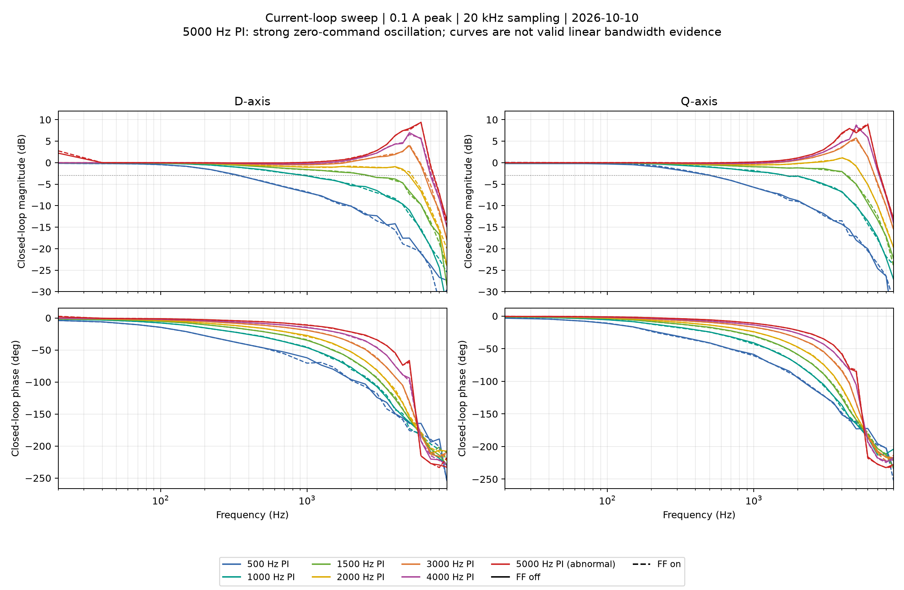
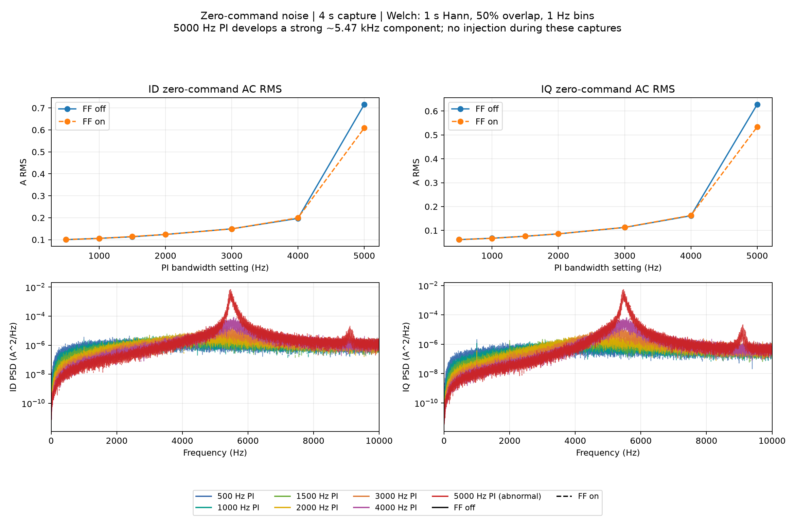
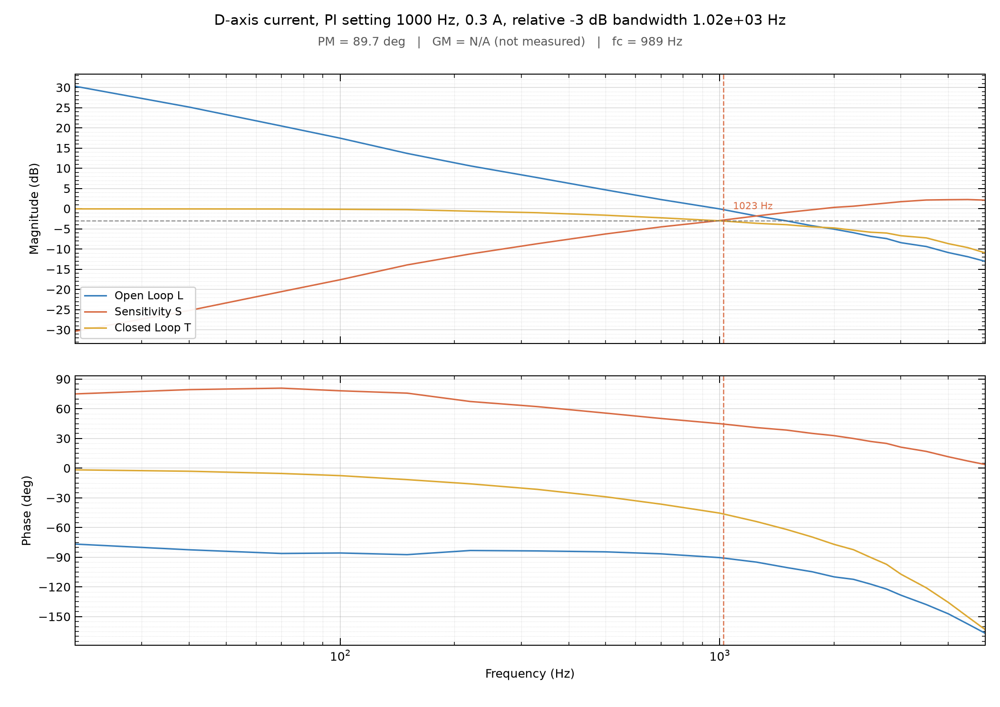
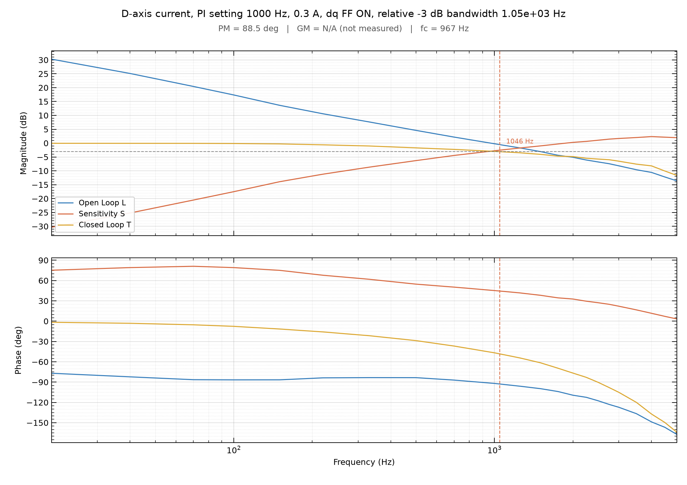

# 有感 D/Q 电流环与速度环频率响应测试

更新：2026-10-10。[10 月 10 日七档带宽 D/Q 与 FFT 对照](#frf-hw-20261010)；
[10 月 9 日 D 轴实测](#frf-hw-20261009)；
[10 月 8 日历史异常](#frf-hw-20261008)。

固件只有一个 `Signal_Injection` 正弦激励模块，PC 端只有一个
`tools/current_frf.py`，用于有感 D/Q 电流环及速度环的闭环频响。
脚本不自动 Enable/Run/保存 Flash；测试前必须手动确认空载、
电机参数、有效电流和速度限幅、编码器标定及 PWM 安全状态。

## 固件测量定义

| `--loop` | 有感模式/状态 | 注入点与控制周期 | FAST 记录的参考、反馈、控制输出 |
|---|---|---|---|
| `id` | TORQUE / ENABLED | 最终 IdRef 限幅前，20 kHz | IdRef / Id / UdPI |
| `iq` | TORQUE / ENABLED | 最终 IqRef 限幅前，20 kHz | IqRef / Iq / UqPI |
| `speed` | SPEED / ENABLED | 轨迹规划后、速度 PI 前，2 kHz | WeRef / WeFbk（ESO）/ IqRef |

D/Q 频响表示电流闭环跟踪；速度频响表示**包含电流内环与 ESO 反馈**
的实际有感速度闭环，不等价于独立测速仪测得的机械转速频响。
三种模式均取实际进入控制器的参考，而非未经过限幅或轨迹处理的用户指令。
PI 电压输出不包含其后的解耦前馈和最终二维电压限幅。

速度环的激励幅值以**机械 rad/s**设置，固件在注入速度 PI 前乘以极对数；
计算时 WeRef 和 WeFbk 都使用电角速度 rad/s，保证两者单位相同。
速度环在 Motor Thread 中以 2 kHz 更新，将同周期 WeRef、WeFbk、IqRef
和电角速度激励原子化发布给 20 kHz FAST Plot。FAST 中的重复值属于
2 kHz 信号的零阶保持，并**不代表速度环以 20 kHz 运行**。

频率边界：D/Q 电流环 0 < f ≤ 9999 Hz，速度环 0 < f ≤ 999 Hz，
均低于对应的 10 kHz / 1 kHz 奈奎斯特频率。
工具执行用户选择的高频频点并输出实测结果，不因高频测量可信度下降而自动降低扫频范围。
测量结果的适用性由用户结合工况自行判断。
D/Q 只允许 TORQUE + ENABLED 启动；速度允许 SPEED + ENABLED
或 SPEED + RUN。RUN 下需要用户先通过正常速度目标/轨迹到达稳定转速，
脚本不自动控制转速；速度正弦只在轨迹之后叠加，不改变轨迹规划器。
Stop/Disable、离开预期状态及快速过流会撤销激励。
每频点到期自动结束，不改变 RUN 工作点及原速度目标。
临时扫频频率、时长、目标和速度幅值可在 RUN 中更新，均只写 RAM；
其他控制参数的 RUN 写入限制保持不变。
速度注入要求有效机械速度幅值不超过速度上限，
D/Q 激励要求电流幅值不超过有效电流上限。

## 唯一 PC 工具

依赖 `pyserial`、`numpy`；画图额外需要 `matplotlib`。

默认采用**指定起止频率的对数扫频**：`--start` / `--stop`
使用整数 Hz，`--points-per-decade` 默认 10。按对数均匀取点后将
频率四舍五入为整数 Hz，去重、升序，并保留用户指定的首尾频率。
如果低频处多个对数频点取整后相同，最终频点数可以少于计算前的数量。
采集前会打印实际使用的全部频率点。也可以用 `--freq` 明确给出不均匀频点，
此时不使用 `--start` / `--stop`。

```bash
# 手动进入 TORQUE + ENABLED 后：D 轴，自动生成 10～9999 Hz 对数整数点
python3 tools/current_frf.py --port /dev/ttyACM0 --loop id \
  --start 10 --stop 9999 --points-per-decade 10 \
  --amp 0.1 --duration 2 --plot --out test-data/frf_id

# 同样在 TORQUE + ENABLED 下测试 Q 轴（0.1 A 峰值）
python3 tools/current_frf.py --port /dev/ttyACM0 --loop iq \
  --start 20 --stop 9999 \
  --amp 0.1 --duration 2 --plot --out test-data/frf_iq

# SPEED + ENABLED：零速小信号（不需要 Run）
python3 tools/current_frf.py --port /dev/ttyACM0 --loop speed \
  --start 1 --stop 999 \
  --amp 0.5 --duration 2 --plot --out test-data/frf_speed_zero

# SPEED + RUN：用户先设置速度目标并运行到稳定工作点
# 例如 1000 RPM 的目标由用户预先配置，脚本不会更改指令
python3 tools/current_frf.py --port /dev/ttyACM0 --loop speed \
  --start 1 --stop 999 \
  --amp 0.5 --duration 2 --plot --out test-data/frf_speed_run

# 仍然支持手动指定任意非均匀频点
python3 tools/current_frf.py --port /dev/ttyACM0 --loop id \
  --freq 20 40 70 100 150 220 330 500 700 1000 1250 \
  --amp 0.1 --duration 2 --plot --out test-data/frf_id_manual
```

速度低频点的注入时长由脚本按至少 `settle_cycles + 3` 个周期自动扩展，
总时长限制 60 秒。频域拟合使用 FAST 同时采集的四个通道：
实际注入、控制器参考、反馈、控制器输出。
舍弃初始 `settle_cycles` 个周期后，进行带直流项的正余弦拟合；
上述例子默认舍弃 4 周期，速度场景应先从较低频率与幅值验证。
正式数据按类型命名，例如 `Current-D-2026-10-10.bode.nmixx`、
`Current-Q-2026-10-10.bode.nmixx` 或 `Speed-2026-10-10.bode.nmixx`；
配套输出 `bode.png`，本地 `point_NNN.raw` 仅用于复核，
`test-data/` 被 Git 忽略。实际使用前需核查当前固件接口。

**注意：** Q 轴注入会产生转矩并可能使转子摆动；速度注入也会引起往复运动，
应确保机械安全。出现大幅运动、异常噪声或电流限幅时，应 Abort/Disable
并停止该轮测试，不要把受限波形解释为线性闭环频响。

## 数据与绘图规范

文件名格式为 `测试名称-YYYY-MM-DD.bode.nmixx`，例如
`Current-Q-2026-10-10.bode.nmixx`；FFT/PSD 分别采用 `.fft.nmixx`、
`.psd.nmixx`。`.nmixx` 是小写扩展名，`bode` 为小写数据类型后缀，
**`BODE.NMIXX` 不是独立文件名，也不是规定的固定名称**。
内部沿用 NumPy NPZ/NPY（ZIP 容器），正式格式版本 2。
Bode 数据文件保存 `format_version`、`freq_hz`、`loop_id`、
`bandwidth_hz`、`ff_enabled`、`tune_source`、`kp`、`ki`
及复数相量 `ref`、`fbk`、`out`，后面三个数组形状为
`[工况, 频点]`。新速度环数据另保存每个频点的
`wm_ref_mean_rad_s`、`wm_fbk_mean_rad_s`、`iq_ref_mean_a`
和极对数 `pole_pairs`，前两个为内控制坐标下的机械 rad/s，
来源是同一频点的正弦拟合直流分量，而不是独立测速。
老版本 v2 数据没有这些可选字段，离线重绘仍兼容。
新版还保存 `quality`、`quality_reason`（各为 `[工况]`），以及
`point_valid`（`[工况, 频点]`）、`fit_residual`、`fit_drift`
（后二者为 `[工况, 频点, 3]`，通道顺序 Ref/Fbk/PI Out）。
残差为原单位 RMS；漂移为前后半段同频复相量之差的模，除以完整记录相量幅值
（分母下限为对应 FAST 通道量化步长）。这些是 v2 的可选质量字段，原相量不变。
缺少质量字段的旧文件按 `unknown` 处理：仍可重绘曲线，但带宽和裕度显示 N/A。
速度环在 Manual 来源时以实际有效 Kp/Ki 命名，
不把无效的 Bandwidth 配置字段误称为当前实际整定带宽。

`T=Fbk/Ref` 是闭环传递函数；`S=1−T`、`L=T/S`
和相位/增益裕度是在单位负反馈假设下从闭环推算，非独立断环测量，
不能仅凭其正负证明实际闭环稳定。
相对 −3 dB 的参考值按最低三个频点的闭环增益均值减 3 dB。
图为统一的横向 A4、180 DPI、上幅频下相频、固定字体/线色/网格/刻度，
未观测到交叉点时显示 N/A，不外推。文档保存条件与结论，
正式实验目录只存 `*.bode.nmixx` 和 PNG；不再添加 JSON、CSV 或单次分析脚本。
脚本采用测试机器的本地日期自动命名，同一目录同名文件不自动覆盖；
多轮同日测试可使用不同 `--out` 目录。

### 相位、质量与 N/A 判定

- PM 由各个 0 dB 交叉处到负实轴的局部有符号角度计算，GM 搜索所有
  `−180°+360°k` 交叉；上升和下降交叉均考虑，取绝对值最小的有符号裕度。
  不再依赖首个频点决定的相位展开分支。该口径与
  [python-control 的经典 SISO 裕度定义](https://github.com/python-control/python-control/blob/main/control/margins.py)
  一致；采样数据仍按对数频率插值，不新增 SciPy/control 依赖。
- 图中相位以接近 `|L|=1` 的已测点为显示分支锚点；显示分支选择不参与有效性判定。
  `T≈1` 导致 L 无法重构的点留空，不以有限假数补齐，也不跨缺口寻找交叉。
- `quality=invalid` 或 `unknown` 时，带宽、PM、GM 和对应交叉频率统一为 N/A，
  图脚注及命令行给出原因。已知振荡/非线性工况不能靠调整相位分支恢复有效指标。
- `quality=valid` 也需逐项通过插值检查。无两侧夹住的交叉、端点恰好等于阈值、
  仅相切或阈值平台不作为已观测交叉。交叉涉及不可靠样本、相邻频率超过 2 倍、
  相位变化达到 120°时，相应指标显示 N/A；PM 绝对值达到 179°时也不报告符号不确定的结果。
  这些是保守的采样质量门槛，不能排除频点之间未观测到的相位绕转。
- 同频拟合中，Ref 或 Fbk 前后半段复相量漂移超过 20% 的频点标为不可靠；
  Ref 残差超过参考峰值的 10%，或 Fbk 残差超过参考峰值的 3 倍时，整组标为 invalid。
  后者仅表示非同频成分过强，不能单独区分噪声、振荡和非线性。
- 新采集默认 `unknown`。只有操作者已核查工况无振荡、无饱和、可作线性小信号分析时，
  才可加 `--linear-verified`；该声明不能跳过上述拟合检查，也不能通过 `--result`
  覆盖归档的质量状态。质量检查在频点采集后的离线拟合阶段执行，**不是实时安全退出**。

本次对 10 月 10 日两个 Bode 归档补充质量字段：500～4000 Hz 结合原始时域、零指令 FFT
及已记录工况复核，允许在上述假设下计算；5000 Hz 四组依据已记录振荡标为 invalid。
24 组较低带宽的 PM/−3 dB 结果与原表一致；其中 D 轴 500/FF0、1000/FF0、1000/FF1
及 Q 轴 500/FF0 的相位交叉附近半段漂移超限，GM 改为 N/A。原始 `ref/fbk/out` 未改动。
10 月 9 日旧归档未补质量证据，新工具重绘显示 unknown；该节历史实测表格保持原始记录口径。

离线回归命令（不连接电机）：

```bash
python3 -m unittest discover -s tools -p test_current_frf.py -v
```

```bash
python3 tools/current_frf.py \
  --result docs/data/20261009_current_frf/Current-D-2026-10-09.bode.nmixx \
  --out test-data/frf_replot
```

### 验证状态

2026-10-10 已用当前固件完成 D/Q 七档带宽、前馈开关对照及 FFT；
5000 Hz 档出现强振荡，不能列为通过，详见下一节。
速度环已完成 100 rad/s 下七档 PI 与原手调参数的八组 Bode 采集，
见[速度环实测记录](速度环与位置环调参记录.md#speed-frf-hw-20261010)；线性带宽及裕度仍未确认。
扫频时保持用户设定的目标速度，脚本仅打印运行前工作点；
**用户需自行确认已稳定后再启动**。尚未实测的带宽或裕度不得记为已验证。

<a id="frf-hw-20261010"></a>
## 2026-10-10：七档电流环带宽、前馈开关及 D/Q / FFT 对照

**结论：** 完成 500、1000、1500、2000、3000、4000、5000 Hz 七档 PI 设置，
每档前馈关/开、D/Q 两轴共 28 组扫频，以及 14 组无注入 FFT/PSD。
当前零转矩指令工况下，500～4000 Hz 的前馈开关差异较小；3000 Hz 开始出现明显
高频增益峰，4000 Hz 的峰值和噪声明显增加。**5000 Hz 出现约 5.47 kHz 强振荡，
瞬时电流远超 0.1 A 激励，接近电压限幅，不作为有效线性带宽或稳定裕度验收。**
没有修改控制源码或保存参数到 Flash；结束已失能并恢复原参数。

### 固件、工况与采集

- 分支 `refactor/nmixx-test-data-archive`，提交
  `9e2de182cac8e658c742548166e26a07597bbf4e`；工作区原有暂存改动为
  `Motor/Motor_Control.c` 增加 `main.h`，本轮保留。
- 使用已有 `build/Release/AxDr_L_Motor.elf`，构建检查为 `no work to do`；
  电机失能时通过 CMSIS-DAP 复位并校验，OpenOCD 报告 `verified 106768 bytes`，
  未重新烧写。ELF SHA256：
  `7e0eaf1a87fc3376f91a156f3fcc0799e7eae3495ea816b205af1d22195d8fdc`。
- 7 极对，Rs=0.282525539 Ω，Ld=Lq=71.382216 μH，Flux=0.002281195 Wb；
  编码器方向 −1，电角度零位 5.533890247 rad，标定有效、Ready/Valid=1。
- TORQUE + ENABLED，零转矩指令，无 Run/恒速工作点；母线测试前后约 24.6 V。
  前馈为已有 dq 解耦/反电动势前馈。没有同步记录完整速度轨迹，不能把本轮结果
  推广为高速前馈效果或独立机械锁轴测量。
- 使用现有 `tools/current_frf.py`，峰值 0.1 A，每点 1 s，20 kHz 四通道
  `Injection / Ref / Fbk / PI Out`；按脚本舍弃起始 4 周期后作含直流项的同频拟合。
  每轴 24 点：20、40、70、100、150、220、330、500、700、1000、1250、1500、
  1750、2000、2500、3000、3500、4000、4500、5000、6000、7000、8000、9000 Hz。
- 每档先 FF=0、后 FF=1，每工况先 D、后 Q，再运行现有 `tools/fft.py`。
  FFT 无正弦注入，20 kHz、约 4 s，通道 `Id / Iq / Ia / Ib / Ic / Ud / Uq`；
  去均值、周期 Hann 窗，FFT 按相干增益校正峰值；Welch 为 20000 点、50% 重叠，
  频率间隔 1 Hz。下表 RMS 为完整原始记录的交流标准差，不是 FFT 单频峰值。
- 正式扫频保存 17,732,340 个样本，FFT 保存 1,124,480 个样本；现有脚本的
  序号缺口、畸形帧检查均通过。没有本轮完整快环时序计数基线，不能据此声称无 ISR 超期。

复现命令示例（带宽和前馈需先配置，电机先进入上述状态）：

```bash
python3 tools/current_frf.py --port /dev/ttyACM1 --loop id \
  --freq 20 40 70 100 150 220 330 500 700 1000 1250 1500 1750 2000 \
  2500 3000 3500 4000 4500 5000 6000 7000 8000 9000 \
  --amp 0.1 --duration 1 --out test-data/current_frf/BW1000_FF0/id

python3 tools/fft.py --port /dev/ttyACM1 \
  --channels id iq ia ib ic ud uq --duration 4 --analysis both \
  --welch-n 20000 --save-raw --name Zero --out test-data/current_frf/BW1000_FF0/fft
```

### 频响结果

表中每格为 **前馈关 / 开**。−3 dB 相对最低三个频点的平均增益，按对数频率插值；
PM 为 `L=T/(1−T)` 推算的 D/Q 两轴较小值，不是独立断环实测。
峰值为本轮已采频点中 D/Q 的最大值，稀疏频点可能漏掉更高的共振峰。

| PI 设置 Hz | D 轴相对 −3 dB Hz | Q 轴相对 −3 dB Hz | D/Q 最小推算 PM ° | D/Q 最大闭环增益 dB |
|---:|---:|---:|---:|---:|
| 500 | 367 / 360 | 539 / 514 | 92.9 / 92.2 | −0.16 / +0.07 |
| 1000 | 1003 / 1046 | 1712 / 1643 | 81.0 / 81.6 | −0.07 / +0.03 |
| 1500 | 2678 / 2633 | 4303 / 4343 | 70.5 / 70.2 | −0.05 / +0.02 |
| 2000 | 5007 / 5216 | 5495 / 5492 | 59.6 / 59.3 | +1.10 / +1.19 |
| 3000 | 6377 / 6523 | 6699 / 6655 | 43.7 / 43.3 | +5.75 / +5.41 |
| 4000 | 6971 / 7106 | 7192 / 7178 | 32.5 / 32.2 | +8.51 / +8.77 |
| 5000 | 不采信线性带宽 | 不采信线性带宽 | 不作有效裕度验收 | +9.37 / +9.40（异常响应） |



设计带宽不是实测 −3 dB 带宽，尤其不能把共振导致的高截止频率视为无代价的性能提升。
3000 Hz 档最小推算增益裕度约 5.0 dB，4000 Hz 约 3.0 dB；结合共振和 FFT 噪声，
本轮支持把 **1000～2000 Hz 作为后续工作点验证范围**，而不是直接采用 4000/5000 Hz。
该判断仅基于本轮小信号工况，不是全速度/负载整定结论。

1000 Hz D 轴与 10 月 9 日约 1 kHz 的结果相近；D/Q 在相同 PI 下的带宽不同，
500 Hz D 轴也不同于历史 0.3 A 激励结果。本轮没有激励幅值、转子角度、实际端电压的
受控对照，不能把差异归因为某个单一硬件或模型参数。由原始相量复算
`PI Out/(Ref−Fbk)`，与当前离散 PI `Kp + Ki*Ts/(1−exp(−jωTs))` 的复数相对误差
中位数为约 0.14%～0.46%，支持参考/反馈/PI 输出信号之间的一致性；
这不是对实际绕组电流或功率级线性的独立校验。

### FFT、5000 Hz 异常及脚本裕度问题

下表每格仍为 **前馈关 / 开**，均为无注入、零转矩指令记录。

| PI 设置 Hz | Id 交流 RMS A | Iq 交流 RMS A |
|---:|---:|---:|
| 500 | 0.1003 / 0.1006 | 0.0617 / 0.0617 |
| 1000 | 0.1063 / 0.1056 | 0.0676 / 0.0670 |
| 1500 | 0.1133 / 0.1145 | 0.0758 / 0.0758 |
| 2000 | 0.1239 / 0.1238 | 0.0857 / 0.0859 |
| 3000 | 0.1496 / 0.1491 | 0.1127 / 0.1131 |
| 4000 | 0.1970 / 0.1996 | 0.1617 / 0.1632 |
| 5000 | 0.7161 / 0.6089 | 0.6277 / 0.5337 |



4000 Hz、前馈关闭的 Id/Iq RMS 分别约为 2000 Hz 的 1.59/1.89 倍。
5000 Hz 的 PSD 主峰为 FF=0 时 5467 Hz、FF=1 时 5464 Hz，两个电流轴均明显出现；
同工况零指令记录的 dq 矢量峰值为 6.05/4.43 A，电压矢量峰值为 12.47/10.85 V。
扫频中单轴反馈峰值最高 6.384 A，单频拟合反馈残差 RMS 最高约 1.71 A，远大于
0.1 A 激励。因而即使文件能计算出约 7.2～7.3 kHz 的 −3 dB 交点，也不把它列为
有效线性带宽。这里的 5.47 kHz 是本轮零指令记录的频谱峰，不能解释成历史高速工况的 6fe。

**退出条件缺口：** 本轮临时把有效电流指令上限设置为 2 A，但该参数限制参考，
不是实际瞬时电流保护阈值。现有扫频脚本检查状态、遥测序号及 int16 饱和，
没有实时反馈电流峰值退出条件；所以本轮虽无板端 Fault/Trip，仍采到了上述大电流。
问题在离线复核时确认；未再追加 5000 Hz 激励。后续复测该档前应先增加并验证
实际电流/电压退出条件，不能仅依赖指令限值或“无故障”判断正常。

**采集时的分析脚本问题（现已完成离线修复）：** 5000 Hz D 轴在 20 Hz 的异常相量使 `np.unwrap` 选到
整体高 360° 的分支，`bode_metrics` 原样输出 PM=375.36°/377.63°，GM 未找到。
以 100～1000 Hz 的连续滞后分支核对后，对应表观 PM 约 15.36°/17.63°，
表观 GM 约 1.42/1.47 dB；Q 轴表观 PM 约 23.2°。这些数值仍受强振荡/非线性影响，
不能作为有效稳定裕度。实机采集时未修改 `tools/current_frf.py`，当时仅作离线显示修正；
本次已在脚本中修复分支相关计算并读取质量字段，重新绘制了独立 PNG。
5000 Hz 的带宽/裕度由归档 invalid 状态统一显示 N/A，并标出振荡/非线性原因，
不再依赖临时绘图修补，也不改写归档相量。

前馈开关在 500～4000 Hz 档的零指令 RMS 差异较小；5000 Hz 的单次噪声差异
不能证明前馈修复了该档异常。没有重复/交换测试顺序，也没有非零恒速对照，
不能据此判断高速解耦效果。

### 后续 PI 基准与扫频工具验收（未完成）

本轮 D/Q 实测及 FFT/PSD 可作为**同一电机、零转矩 ENABLED 工况下**
的历史比较数据，但还不是最终冻结的 PI 基准。下一轮优先以
**1000、1500、2000 Hz 设计带宽**进行重复性、噪声、实际运动及非零
工作点对照，保持电机参数、母线、采样、激励幅值、频点与负载条件可比。
500 Hz 可作为低带宽参考，3000～4000 Hz 可作为高带宽及峰化/噪声
权衡的对照；**5000 Hz 仅作为异常证据，不用于选定稳定 PI 或比较有效带宽**。
本轮前馈开启/关闭主要是在零转矩 ENABLED 工况测量，不能据此断言高速
反电动势前馈的收益或损失；后续仍需高速运行工作点的受控对照。

在继续扩大参数范围或复测已振荡的 5000 Hz 档前，工具问题状态如下：

- **扫频异常退出**：需要对实际反馈电流和电压利用率进行及时监测，
  设定符合当次电机/硬件条件的测试中止阈值，必要时立即撤销激励；
  不能把用户指令电流限制、FAST int16 裁剪检查或无 Fault/Trip
  等同于实际电流安全退出。新增检查不得替代硬件过流保护。
- **相位展开与裕度：已完成离线修复。** 不依赖低频初始展开分支计算裕度，
  结合归档质量状态及交叉点质量，对振荡、非线性、质量未知或不足的结果显示 N/A。
  已补解析算例、异常分支、缺失/多个交叉及历史数据回归；`L=T/(1−T)`
  仍是按单位负反馈假设由闭环推算，并非独立断环实测。

本次只进行了离线算例及历史较低带宽数据回归，未执行新的电机实测。
实际电流/电压异常退出仍未修复，不能据此继续高风险工况测试。
速度环另完成了 `SPEED + RUN`、100 rad/s 八组采集，
见[速度环记录](速度环与位置环调参记录.md#speed-frf-hw-20261010)；零速仅进行试采。
速度 PI 应单独选择基准，不将电流环的设计 Hz 直接套用到速度环。

### 归档与最终状态

正式目录 [20261010_current_frf](data/20261010_current_frf/) 只包含 NMIXX 与 PNG：

- [Current-D-2026-10-10.bode.nmixx](data/20261010_current_frf/Current-D-2026-10-10.bode.nmixx)
  与 [Current-Q-2026-10-10.bode.nmixx](data/20261010_current_frf/Current-Q-2026-10-10.bode.nmixx)：
  每个文件 14 工况 × 24 频点，格式版本 2；按带宽升序、同带宽先 FF=0 后 FF=1。
  `ref/fbk/out` 与原工具输出逐元素一致，5000 Hz 的异常原始相量也保留。
- 每个 `BW<带宽>_FF<0或1>/` 子目录保存原工具输出的 FFT/PSD NMIXX 及对应 PNG；
  归档文件名同时包含工况，例如 `BW1000_FF0/` 下为
  `Zero-BW1000Hz-FF0-2026-10-10.fft.nmixx`、
  `Zero-BW1000Hz-FF0-2026-10-10.psd.nmixx` 及同名 `.fft.png`、`.psd.png`。
  `Zero` 表示扫频结束后的零转矩指令、无注入采集，不是扫频期间的 FFT。
  归档仅重命名，文件内容不变；保留工具当前频谱格式版本 1，不把频谱版本伪改为 Bode 的版本 2。
- 根目录两张对照 PNG，以及每档 D/Q、前馈关/开的 28 张独立 Bode PNG。
  独立图调用 `plot_bode_a4`，横向 A4、180 DPI，上幅频下相频，保留 L/S/T 曲线样式；
  文件名包含轴、PI 带宽、前馈状态、日期，例如
  `Current-D-BW1000Hz-FF0-2026-10-10.bode.png`。
  共 30 个 NMIXX、58 张 PNG，无 JSON、CSV、原始时域文件或脚本。

| PI 设置 Hz | D 轴 FF=0 | D 轴 FF=1 | Q 轴 FF=0 | Q 轴 FF=1 |
|---:|---|---|---|---|
| 500 | [PNG](data/20261010_current_frf/Current-D-BW500Hz-FF0-2026-10-10.bode.png) | [PNG](data/20261010_current_frf/Current-D-BW500Hz-FF1-2026-10-10.bode.png) | [PNG](data/20261010_current_frf/Current-Q-BW500Hz-FF0-2026-10-10.bode.png) | [PNG](data/20261010_current_frf/Current-Q-BW500Hz-FF1-2026-10-10.bode.png) |
| 1000 | [PNG](data/20261010_current_frf/Current-D-BW1000Hz-FF0-2026-10-10.bode.png) | [PNG](data/20261010_current_frf/Current-D-BW1000Hz-FF1-2026-10-10.bode.png) | [PNG](data/20261010_current_frf/Current-Q-BW1000Hz-FF0-2026-10-10.bode.png) | [PNG](data/20261010_current_frf/Current-Q-BW1000Hz-FF1-2026-10-10.bode.png) |
| 1500 | [PNG](data/20261010_current_frf/Current-D-BW1500Hz-FF0-2026-10-10.bode.png) | [PNG](data/20261010_current_frf/Current-D-BW1500Hz-FF1-2026-10-10.bode.png) | [PNG](data/20261010_current_frf/Current-Q-BW1500Hz-FF0-2026-10-10.bode.png) | [PNG](data/20261010_current_frf/Current-Q-BW1500Hz-FF1-2026-10-10.bode.png) |
| 2000 | [PNG](data/20261010_current_frf/Current-D-BW2000Hz-FF0-2026-10-10.bode.png) | [PNG](data/20261010_current_frf/Current-D-BW2000Hz-FF1-2026-10-10.bode.png) | [PNG](data/20261010_current_frf/Current-Q-BW2000Hz-FF0-2026-10-10.bode.png) | [PNG](data/20261010_current_frf/Current-Q-BW2000Hz-FF1-2026-10-10.bode.png) |
| 3000 | [PNG](data/20261010_current_frf/Current-D-BW3000Hz-FF0-2026-10-10.bode.png) | [PNG](data/20261010_current_frf/Current-D-BW3000Hz-FF1-2026-10-10.bode.png) | [PNG](data/20261010_current_frf/Current-Q-BW3000Hz-FF0-2026-10-10.bode.png) | [PNG](data/20261010_current_frf/Current-Q-BW3000Hz-FF1-2026-10-10.bode.png) |
| 4000 | [PNG](data/20261010_current_frf/Current-D-BW4000Hz-FF0-2026-10-10.bode.png) | [PNG](data/20261010_current_frf/Current-D-BW4000Hz-FF1-2026-10-10.bode.png) | [PNG](data/20261010_current_frf/Current-Q-BW4000Hz-FF0-2026-10-10.bode.png) | [PNG](data/20261010_current_frf/Current-Q-BW4000Hz-FF1-2026-10-10.bode.png) |
| 5000（异常） | [PNG](data/20261010_current_frf/Current-D-BW5000Hz-FF0-2026-10-10.bode.png) | [PNG](data/20261010_current_frf/Current-D-BW5000Hz-FF1-2026-10-10.bode.png) | [PNG](data/20261010_current_frf/Current-Q-BW5000Hz-FF0-2026-10-10.bode.png) | [PNG](data/20261010_current_frf/Current-Q-BW5000Hz-FF1-2026-10-10.bode.png) |

原始四通道扫频、七通道 FFT、前后参数及离线统计保留在本机
`test-data/current_matrix_20261010/formal/`，执行日志在同级 `formal.log`，不纳入正式归档。
早期临时八通道试采未并入本节正式数据。NMIXX Bode 保存相量，频谱文件保存频域结果，
二者均不能替代这些本地原始时域数据。

结束后再次通过 USB 读回：DISABLED，Signal Active=0，前馈=0，电流环恢复
Bandwidth 2000 Hz，有效电流指令上限恢复 10 A，原注入参数恢复；
编码器 Fault=0，最终 Fault/Trip=0。未执行 Save，也未改写原有编码器标定。

<a id="frf-hw-20261009"></a>
## 2026-10-09：1000 Hz D 轴扫频复测

同一电机、SPI 编码器（7 极对），TORQUE + ENABLED，Iq_ref=0；
24.7 V 母线，电流环 20 kHz，Bandwidth 模式 1000 Hz，
Rs=0.282525539 Ω、Ld=Lq=71.382216 μH，
Kp=0.448507688、Ki=1775.160318；
本轮保存的编码器方向 −1、电角度零位 5.533890247 rad。
采样 20 kHz、每点 1 s、峰值 0.3 A，20～5000 Hz 共 22 点；
舍弃起始 max(4 周期, 50 ms)，同频正余弦拟合；无 FAST 序号缺口或板端故障。
结束恢复原配置并 Disable。本轮使用用户已烧录的固件，未重新编译下载，
对应的精确固件构建哈希未在当时的实验记录中提供。

| 工况 | 相对 −3 dB 频率 | 推算 L 的 0 dB 交叉频率 | 推算相位裕度 |
|---|---:|---:|---:|
| 前馈关闭 | 1022.67 Hz | 988.66 Hz | 89.70° |
| 前馈开启 | 1046.41 Hz | 966.50 Hz | 88.48° |




两组数据合并到 [Current-D-2026-10-09.bode.nmixx](data/20261009_current_frf/Current-D-2026-10-09.bode.nmixx)，
已迁移到统一格式版本 2，以 `ref`、`fbk`、`out` 保存原有的 IdRef、Id、UdPI
复数相量（`loop_id=0`、`ff_enabled=[0,1]`），数值不重新拟合或改写。
原始时域采样在当时仅存本机 `/tmp/d_axis_frf_1000_20261009` 及
`/tmp/d_axis_frf_1000_ff_20261009`，本次未验证其是否仍存在，因此不宣称已归档。

**与旧测试的差异待查**：2026-10-08 旧测试在 1000 Hz PI 下测得约 3519 Hz 的绝对 −3 dB
频率，而本轮得到约 1 kHz。电机/编码器未拆装；两轮保存的电角度零位存在约 0.573 rad 差异，
不能简单归因为安装变化。旧数据未发现明显的 Bode 插值错误，根因尚未确认。

## 验证范围

- 2026-10-08 D 轴历史注入退出验证和三组频响/PSD 记录仅作为旧实验结论；
  其中频响异常原因尚未定位。
- 2026-10-09 D 轴在 1000 Hz PI 设置下完成前馈开关对照；2026-10-10 已补充
  D/Q 七档对照与 FFT，5000 Hz 档异常；速度环已另完成 100 rad/s 八组 Bode 采集，
  线性带宽及裕度仍未确认。
- 尚未完成加载工况、全速域、受控的电压/电流限幅测试及独立传感器核验；
  不推断未扫到的交叉频率。

<a id="frf-hw-20261008"></a>
## 2026-10-08：旧频响实验（异常记录，仅保留结论）

同一 STM32G474 开发板及电机/编码器，TORQUE + ENABLED，
母线约 24.6 V，Iq_ref=0；电流环 20 kHz，ADC 2×47.5 cycles、
40 MHz，前馈关闭。固件源码提交
`aa0425923db2be0a4149828f59a2340b06deff04`，
ELF SHA256：
`30bfa9933369c6af7a987a5570883b9c3f61216342b4803798afe9d13e5f2352`。
注入峰值 0.3 A，每频点 1 s，20～5000 Hz 共 22 点，
先后使用 2000、1000、500 Hz 的 Bandwidth 设置。
本轮历史频点拟合值与后来 10 月 9 日的复测不一致，**异常原因未确认**。

| 电流环 PI 设置 | 旧报告绝对 −3 dB | 按相对低频 −3 dB 复算 |
|---|---:|---:|
| 500 Hz | 484.7 Hz | 499.4 Hz |
| 1000 Hz | 3519.1 Hz | 3534.1 Hz |
| 2000 Hz | 5000 Hz 以内未测到 | 5000 Hz 以内未测到 |

其中旧 1000 Hz 响应在 1250～2750 Hz 存在约 −2.3 dB 平台；
旧 2000 Hz 在 4500 Hz 有 +2.379 dB 增益峰值。改变 −3 dB 的
定义不能解释异常；原始 FAST 尚未逐样本复算。历史控制器
`UdPI/(IdRef−Id)` 与理论离散 PI 在 100 Hz 及以上基本一致，
但不能证明实际绕组电流没有采样或运行工况误差。

同轮还验证了注入自然结束、Stop、Disable 和 Abort 能撤销激励，
且无新增故障、采集丢帧或超期。注入使 ADC_Run 中位耗时约增加
0.93 μs；Disable 后出现 IdRef 遥测残留，重新 Enable 后归零。

**归档决策：** 本轮 Bode/PSD 原始文件与图像不再保留在当前工作树；
历史结果仅留本节文字，不能作为已验证带宽使用。历史 Git 提交
`204215f891810296f5a549909a76d97da9c9c2a4` 仍可恢复当时的
`docs/data/current_frf_20261008/`，本次不重写提交历史。
